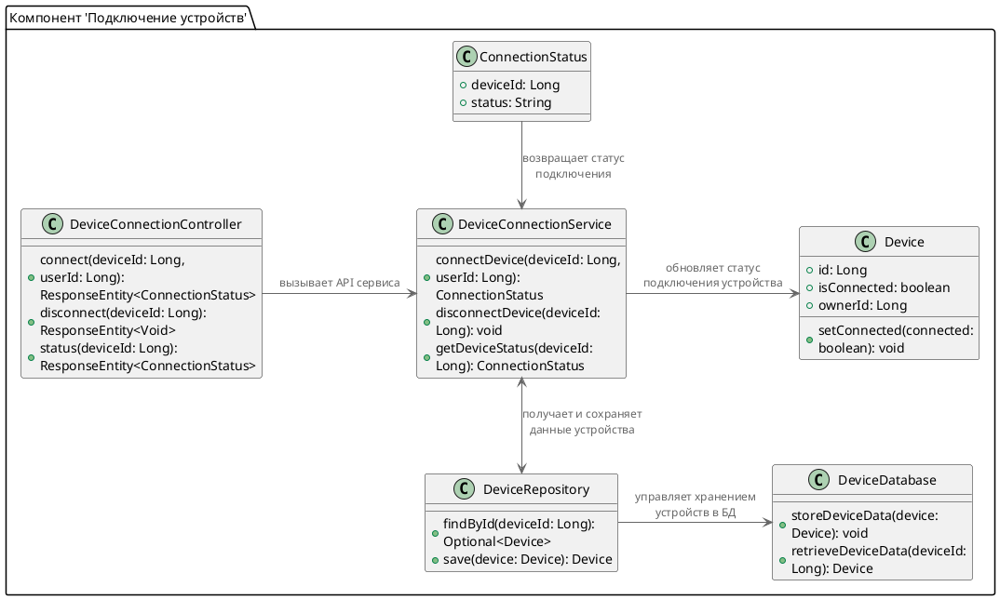

```puml
@startuml
!include <C4/C4_Component>

LAYOUT_TOP_DOWN()

package "Компонент 'Подключение устройств'"  {
class "DeviceConnectionService" as DeviceConnectionService {
    +connectDevice(deviceId: Long, userId: Long): ConnectionStatus
    +disconnectDevice(deviceId: Long): void
    +getDeviceStatus(deviceId: Long): ConnectionStatus
}

class "DeviceConnectionController" as DeviceConnectionController {
    +connect(deviceId: Long, userId: Long): ResponseEntity<ConnectionStatus>
    +disconnect(deviceId: Long): ResponseEntity<Void>
    +status(deviceId: Long): ResponseEntity<ConnectionStatus>
}

class "DeviceRepository" as DeviceRepository {
    +findById(deviceId: Long): Optional<Device>
    +save(device: Device): Device
}

class "Device" as Device {
    +id: Long
    +isConnected: boolean
    +ownerId: Long
    +setConnected(connected: boolean): void
}

class "ConnectionStatus" as ConnectionStatus {
    +deviceId: Long
    +status: String
}

class "DeviceDatabase" as DeviceDatabase {
    +storeDeviceData(device: Device): void
    +retrieveDeviceData(deviceId: Long): Device
}
}

DeviceConnectionService <--> DeviceRepository : получает и сохраняет данные устройства
DeviceConnectionService -> Device : обновляет статус подключения устройства
ConnectionStatus --> DeviceConnectionService : возвращает статус подключения
DeviceConnectionController -> DeviceConnectionService : вызывает API сервиса
DeviceRepository -> DeviceDatabase : управляет хранением устройств в БД
@enduml
```