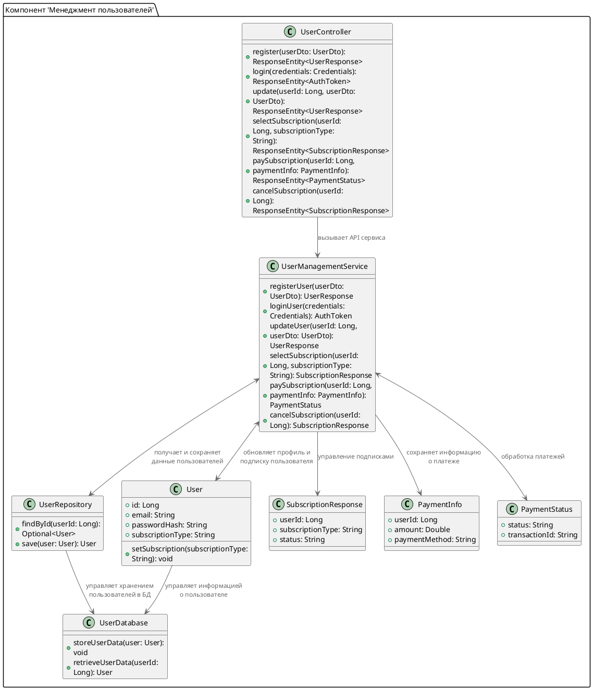

```puml
@startuml
!include <C4/C4_Component>

LAYOUT_TOP_DOWN()

package "Компонент 'Менеджмент пользователей'" {
class "UserManagementService" as UserManagementService {
    +registerUser(userDto: UserDto): UserResponse
    +loginUser(credentials: Credentials): AuthToken
    +updateUser(userId: Long, userDto: UserDto): UserResponse
    +selectSubscription(userId: Long, subscriptionType: String): SubscriptionResponse
    +paySubscription(userId: Long, paymentInfo: PaymentInfo): PaymentStatus
    +cancelSubscription(userId: Long): SubscriptionResponse
}

class "UserController" as UserController {
    +register(userDto: UserDto): ResponseEntity<UserResponse>
    +login(credentials: Credentials): ResponseEntity<AuthToken>
    +update(userId: Long, userDto: UserDto): ResponseEntity<UserResponse>
    +selectSubscription(userId: Long, subscriptionType: String): ResponseEntity<SubscriptionResponse>
    +paySubscription(userId: Long, paymentInfo: PaymentInfo): ResponseEntity<PaymentStatus>
    +cancelSubscription(userId: Long): ResponseEntity<SubscriptionResponse>
}

class "UserRepository" as UserRepository {
    +findById(userId: Long): Optional<User>
    +save(user: User): User
}

class "User" as User {
    +id: Long
    +email: String
    +passwordHash: String
    +subscriptionType: String
    +setSubscription(subscriptionType: String): void
}

class "SubscriptionResponse" as SubscriptionResponse {
    +userId: Long
    +subscriptionType: String
    +status: String
}

class "PaymentInfo" as PaymentInfo {
    +userId: Long
    +amount: Double
    +paymentMethod: String
}

class "PaymentStatus" as PaymentStatus {
    +status: String
    +transactionId: String
}

class "UserDatabase" as UserDatabase {
    +storeUserData(user: User): void
    +retrieveUserData(userId: Long): User
}

}


UserManagementService <--> UserRepository : получает и сохраняет данные пользователей
UserManagementService <--> User : обновляет профиль и подписку пользователя
UserManagementService --> SubscriptionResponse : управление подписками
UserManagementService <--> PaymentStatus : обработка платежей
UserManagementService --> PaymentInfo : сохраняет информацию  о платеже
UserController --> UserManagementService : вызывает API сервиса
UserRepository --> UserDatabase : управляет хранением пользователей в БД
User --> UserDatabase : управляет информацией о пользователе
@enduml
```