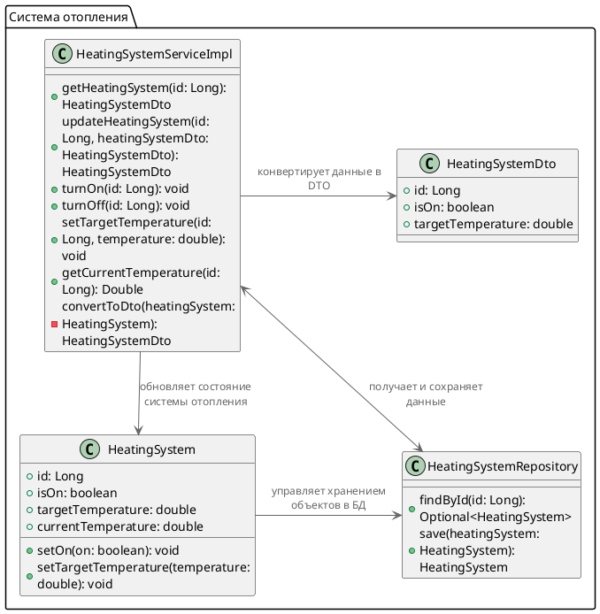

```puml
@startuml
!include <C4/C4_Component>

LAYOUT_TOP_DOWN()

package "Система отопления" {
  class "HeatingSystemServiceImpl" as HeatingSystemServiceImpl {
    +getHeatingSystem(id: Long): HeatingSystemDto
    +updateHeatingSystem(id: Long, heatingSystemDto: HeatingSystemDto): HeatingSystemDto
    +turnOn(id: Long): void
    +turnOff(id: Long): void
    +setTargetTemperature(id: Long, temperature: double): void
    +getCurrentTemperature(id: Long): Double
    -convertToDto(heatingSystem: HeatingSystem): HeatingSystemDto
}

  class "HeatingSystemRepository" as HeatingSystemRepository {
    +findById(id: Long): Optional<HeatingSystem>
    +save(heatingSystem: HeatingSystem): HeatingSystem
}

  class "HeatingSystem" as HeatingSystem {
    +id: Long
    +isOn: boolean
    +targetTemperature: double
    +currentTemperature: double
    +setOn(on: boolean): void
    +setTargetTemperature(temperature: double): void
}

  class "HeatingSystemDto" as HeatingSystemDto {
    +id: Long
    +isOn: boolean
    +targetTemperature: double
}
}


HeatingSystemServiceImpl <-> HeatingSystemRepository : получает и сохраняет данные
HeatingSystemServiceImpl --> HeatingSystem : обновляет состояние системы отопления
HeatingSystemServiceImpl -> HeatingSystemDto : конвертирует данные в DTO
HeatingSystem  -> HeatingSystemRepository : управляет хранением объектов в БД
@enduml
```