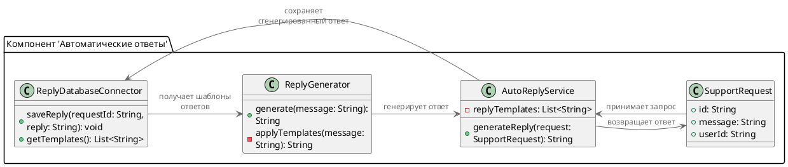

```puml
@startuml
!include <C4/C4_Component>

LAYOUT_TOP_DOWN()

package "Компонент 'Автоматические ответы'" {

class "AutoReplyService" as AutoReplyService {
    +generateReply(request: SupportRequest): String
    -replyTemplates: List<String>
}

class "SupportRequest" as SupportRequest {
    +id: String
    +message: String
    +userId: String
}

class "ReplyGenerator" as ReplyGenerator {
    +generate(message: String): String
    -applyTemplates(message: String): String
}

class "ReplyDatabaseConnector" as ReplyDatabaseConnector{
    +saveReply(requestId: String, reply: String): void
    +getTemplates(): List<String>
}
}


SupportRequest  -> AutoReplyService : принимает запрос
AutoReplyService -> SupportRequest : возвращает ответ
ReplyGenerator  -> AutoReplyService : генерирует ответ
ReplyDatabaseConnector-> ReplyGenerator : получает шаблоны ответов
AutoReplyService -> ReplyDatabaseConnector: сохраняет сгенерированный ответ
@enduml
```