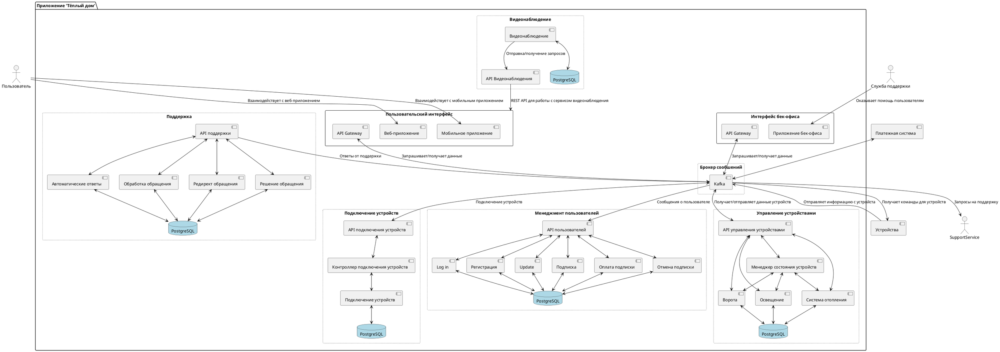

```puml
@startuml
actor User as "Пользователь"
actor Support as "Служба поддержки"
component Devices as "Устройства"
component PaymentSystem as "Платежная система"


package "Приложение 'Тёплый дом'" {
    rectangle "Пользовательский интерфейс" as UserInterface {
        component "Веб-приложение" as WebApplication
        component "Мобильное приложение" as MobileApplication
        component "API Gateway" as APIGateway
    }

    

    rectangle "Брокер сообшений" #line.dotted {
        component "Kafka" as MessageBroker {
        }
    }

    
    rectangle "Управление устройствами" as DeviceManagement #line.dotted {
        component "Освещение" as Lighting
        component "Ворота" as Gates
        component "Система отопления" as HeatingSystem
        component "API управления устройствами" as DeviceManagementAPI 
        component "Менеджер состояния устройств" as DeviceStateManager
        database "PostgreSQL" as DBDeviceManagement #lightblue
    }
    
    rectangle "Видеонаблюдение" #line.dotted {
        component "Видеонаблюдение" as Surveillance 
        component "API Видеонаблюдения" as SurveillanceAPI
        database "PostgreSQL" as DBSurveillance  #lightblue
    }

    rectangle "Подключение устройств" #line.dotted {
        component "Контроллер подключения устройств" as DeviceConnectionController
        component "API подключения устройств" as DeviceConnectionAPI
        component "Подключение устройств" as DeviceConnection
        database "PostgreSQL" as DBDeviceConnection #lightblue
    }
    
    rectangle "Менеджмент пользователей" #line.dotted {
        component "API пользователей" as UserManagementAPI
        component "Log in" as UserManagementLogIn
        component "Регистрация" as UserManagementRegistration
        component "Update" as UserManagementUpdate
        component "Подписка" as UserManagementSubscribtion
        component "Оплата подписки" as UserManagementPayment
        component "Отмена подписки" as UserManagementCancelSubscribtion
        database "PostgreSQL" as DBUserManagement #lightblue
    }
    
    rectangle "Поддержка" #line.dotted {
        component "API поддержки" as SupportServiceAPI
        component "Автоматические ответы" as AutoSupport
        component "Обработка обращения" as SupportProcessing
        component "Редирект обращения" as SupportRedirect
        component "Решение обращения" as SupportResolution
        database "PostgreSQL" as DBSupportService #lightblue
    }

    rectangle "Интерфейс бек-офиса" as BackOfficeInterface {
        component "Приложение бек-офиса" as BackOfficeApplication
        component "API Gateway" as BackOfficeAPIGateway
    }
    
}

User --> WebApplication: Взаимодействует с веб-приложением
User --> MobileApplication: Взаимодействует с мобильным приложением

APIGateway <--> MessageBroker: Запрашивает/получает данные

MessageBroker <--> DeviceManagementAPI: Получает/отправляет данные устройств
Surveillance --> SurveillanceAPI: Отправка/получение запросов
SurveillanceAPI --> UserInterface: REST API для работы с сервисом видеонаблюдения
DeviceManagementAPI <--> Gates
DeviceManagementAPI <--> Lighting
DeviceManagementAPI <--> HeatingSystem
DeviceManagementAPI <--> DeviceStateManager
DeviceStateManager <--> Gates
DeviceStateManager <--> Lighting
DeviceStateManager <--> HeatingSystem

Devices --> MessageBroker: Отправляет информацию с устройста
PaymentSystem <--> MessageBroker
MessageBroker --> Devices: Получает команды для устройств


MessageBroker --> SupportService: Запросы на поддержку
SupportServiceAPI --> MessageBroker: Ответы от поддержки
SupportServiceAPI <--> AutoSupport
SupportServiceAPI <--> SupportProcessing
SupportServiceAPI <--> SupportRedirect
SupportServiceAPI <--> SupportResolution
AutoSupport <--> DBSupportService
SupportProcessing <--> DBSupportService
SupportResolution <--> DBSupportService
SupportRedirect <--> DBSupportService
BackOfficeAPIGateway <--> MessageBroker: Запрашивает/получает данные
Support --> BackOfficeApplication: Оказывает помощь пользователям

MessageBroker <--> DeviceConnectionAPI: Подключение устройств
DeviceConnectionAPI <--> DeviceConnectionController
DeviceConnectionController <--> DeviceConnection 
DeviceConnection <--> DBDeviceConnection

MessageBroker --> UserManagementAPI: Сообщения о пользователе
UserManagementAPI <--> UserManagementLogIn
UserManagementAPI <--> UserManagementRegistration
UserManagementAPI <--> UserManagementUpdate
UserManagementAPI <--> UserManagementSubscribtion
UserManagementAPI <--> UserManagementPayment
UserManagementAPI <--> UserManagementCancelSubscribtion
UserManagementLogIn <--> DBUserManagement
UserManagementRegistration <--> DBUserManagement
UserManagementUpdate <--> DBUserManagement
UserManagementSubscribtion <--> DBUserManagement
UserManagementPayment <--> DBUserManagement
UserManagementCancelSubscribtion <--> DBUserManagement


Lighting <--> DBDeviceManagement
Gates <--> DBDeviceManagement
Surveillance <--> DBSurveillance  
HeatingSystem <--> DBDeviceManagement
@enduml
```