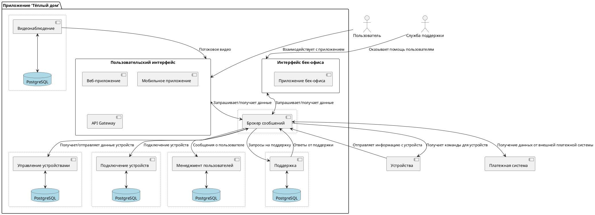

```puml
@startuml
actor User as "Пользователь"
actor Support as "Служба поддержки"
component Devices as "Устройства"
component PaymentSystem as "Платежная система"


package "Приложение 'Тёплый дом'" {
    rectangle "Пользовательский интерфейс" as UserInterface {
        component "Веб-приложение" as WebApplication
        component "Мобильное приложение" as MobileApplication
        component "API Gateway" as APIGateway
    }

    

    rectangle #line.dotted {
        component "Брокер сообшений" as MessageBroker {
        }
    }

   rectangle #line.dotted {
        component "Видеонаблюдение" as Surveillance 
        database "PostgreSQL" as DBSurveillance  #lightblue
    }
    
    
    rectangle #line.dotted {
        component "Управление устройствами" as DeviceManagement
        component "Видеонаблюдение" as Surveillance 
        database "PostgreSQL" as DBDeviceManagement #lightblue
    }

    
    rectangle #line.dotted {
        component "Подключение устройств" as DeviceConnection
        database "PostgreSQL" as DBDeviceConnection #lightblue
    }
    
    rectangle #line.dotted {
        component "Менеджмент пользователей" as UserManagement
        database "PostgreSQL" as DBUserManagement #lightblue
    }
    
    rectangle #line.dotted {
        component "Поддержка" as SupportService
        database "PostgreSQL" as DBSupportService #lightblue
    }

    rectangle "Интерфейс бек-офиса" as BackOfficeInterface {
        component "Приложение бек-офиса" as BackOfficeApplication
    }
    
}

User --> UserInterface: Взаимодействует с приложением
UserInterface <--> MessageBroker: Запрашивает/получает данные
MessageBroker <--> DeviceManagement: Получает/отправляет данные устройств
Devices --> MessageBroker: Отправляет информацию с устройста
MessageBroker --> Devices: Получает команды для устройств
MessageBroker --> DeviceConnection: Подключение устройств
MessageBroker --> UserManagement: Сообщения о пользователе
MessageBroker --> SupportService: Запросы на поддержку
SupportService --> MessageBroker: Ответы от поддержки
BackOfficeInterface <--> MessageBroker: Запрашивает/получает данные
Surveillance --> UserInterface: Потоковое видео
Support --> BackOfficeInterface: Оказывает помощь пользователям
DeviceConnection <--> DBDeviceConnection
UserManagement <--> DBUserManagement
SupportService <--> DBSupportService
MessageBroker <--> PaymentSystem: Получение данных от внешней платежной системы 

DeviceManagement <--> DBDeviceManagement
Surveillance <--> DBSurveillance  
@enduml
```