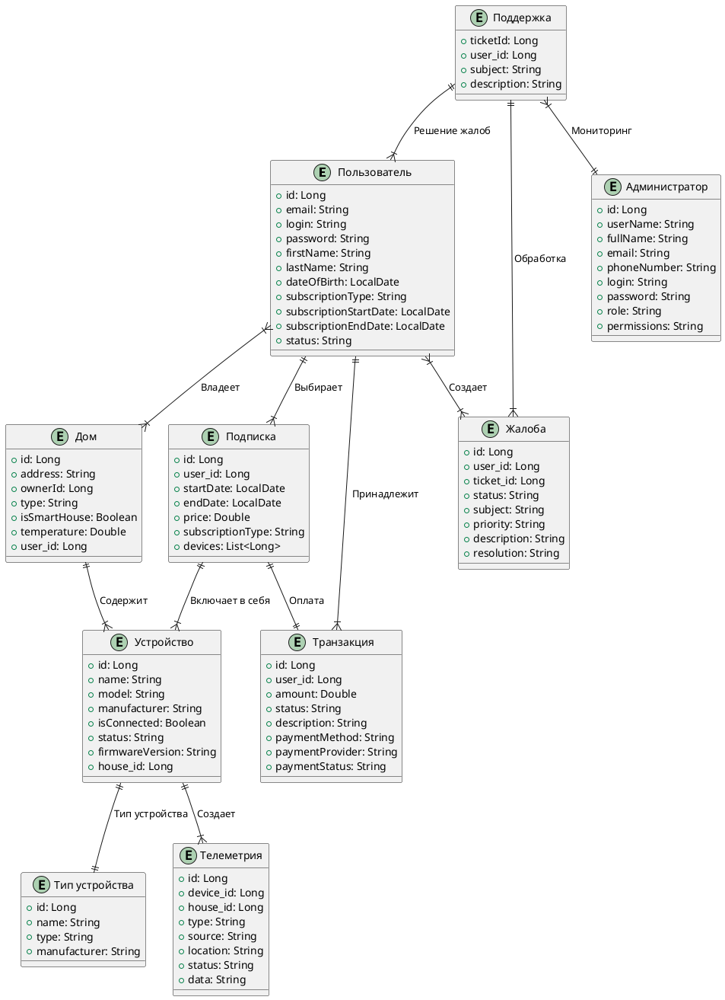

```puml
@startuml

entity "Пользователь" as User {
    +id: Long
    +email: String
    +login: String
    +password: String
    +firstName: String
    +lastName: String
    +dateOfBirth: LocalDate
    +subscriptionType: String
    +subscriptionStartDate: LocalDate
    +subscriptionEndDate: LocalDate
    +status: String
}

entity "Дом" as House {
    +id: Long
    +address: String
    +ownerId: Long
    +type: String
    +isSmartHouse: Boolean
    +temperature: Double
    +user_id: Long
}

entity "Устройство" as Device {
    +id: Long
    +name: String
    +model: String
    +manufacturer: String
    +isConnected: Boolean
    +status: String
    +firmwareVersion: String
    +house_id: Long
}

entity "Тип устройства" as DeviceType {
    +id: Long
    +name: String
    +type: String
    +manufacturer: String
}

entity "Телеметрия" as TelemetryData {
    +id: Long
    +device_id: Long
    +house_id: Long
    +type: String
    +source: String
    +location: String
    +status: String
    +data: String
}

entity "Администратор" as Administrator {
    +id: Long
    +userName: String
    +fullName: String
    +email: String
    +phoneNumber: String
    +login: String
    +password: String
    +role: String
    +permissions: String
}

entity "Поддержка" as Support {
    +ticketId: Long
    +user_id: Long
    +subject: String
    +description: String
}

entity "Жалоба" as Claim {
    +id: Long
    +user_id: Long
    +ticket_id: Long
    +status: String
    +subject: String
    +priority: String
    +description: String
    +resolution: String
}

entity "Подписка" as Subscription {
    +id: Long
    +user_id: Long
    +startDate: LocalDate
    +endDate: LocalDate
    +price: Double
    +subscriptionType: String
    +devices: List<Long>
}

entity "Транзакция" as Transaction {
    +id: Long
    +user_id: Long
    +amount: Double
    +status: String
    +description: String
    +paymentMethod: String
    +paymentProvider: String
    +paymentStatus: String
}


House ||--|{ Device : "Содержит"

Device ||--|| DeviceType : "Тип устройства"
Device ||--|{ TelemetryData : "Создает"

User }|--|{ House : "Владеет"

User }|--|{ Claim : "Создает"
User ||--|{ Subscription : "Выбирает"

Subscription ||--|{ Device : "Включает в себя"
Subscription ||--|| Transaction : "Оплата"

Transaction }|--|| User : "Принадлежит"


Support }|--|| Administrator : "Мониторинг"
Support ||--|{ User : "Решение жалоб"
Support ||--|{ Claim : "Обработка"
@enduml
```